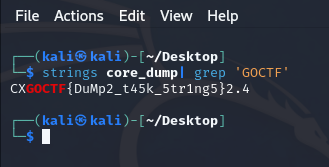

# DUMPit

### Сложность

Easy

### Информация

```
Цифрового ковбоя, виртуального защитника мира киберпространства, взломали, и его система оказалась скомпрометирована. Теперь ему предстоит срочно найти ценную информацию в своем дампе памяти, прежде чем злоумышленники воспользуются ею. Стоя перед вызовом восстановить свою безопасность и репутацию, Цифровой ковбой готов сразиться с виртуальными препятствиями и извлечь ключевые данные из глубин своего внутреннего мира.
```

### Описание

Предстоит исследовать дамп, чтобы обнаружить данные, используя техники расследования дампов памяти.

### Выдать учаcтникам

`zip-архив - dump.zip`

### Решение

Для решения, понадобятся 2 инструмента: `strings` и `grep`. Ищем флаг по его началу `GOCTF`, так должна выглядеть команда: `strings core_dump | grep 'GOCTF'`.



### Флаг

GOCTF{DuMp2_t45k_5tr1ng5}
