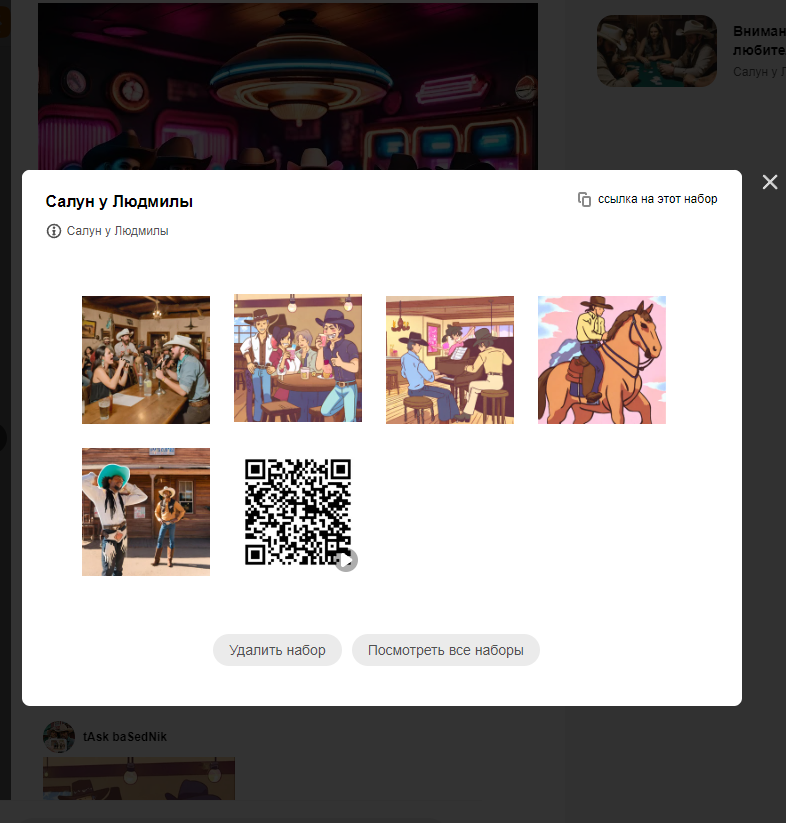
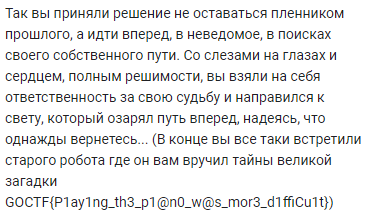

# ChasingTheFlag

### Сложность

Hard

### Информация

```
После того как вы успешно сыграли на пианино в салуне, из толпы яростных фанатов к вам подошел бот с идентификационным номером innokentiygoctf_bot, с просьбой помочь разгадать тайну, которую его предки не могут разгадать уже несколько столетий. "Возможно, ты сможешь помочь мне?" - спросил он. "Они нашли первую часть великой загадки, но не передали мне ее" - добавил бот
```

### Описание

Вы отправитесь в увлекательное приключение, следуя по следам древних загадок и тайн. Вашей целью будет разгадать тайну Великого Клада, которая хранится в самом сердце интернета. Решение делится на 3 этапа. 

### Запуск

Запуск телеграм бота 

```
cd deploy
python3 telegram.py
```

### Выдать учаcтникам

-

### Решение

Первым делом в информации к заданию мы видим ник бота `innokentiygoctf_bot`, переходим в телеграмм и получаем первую подсказку
```
Путь к Великому Кладу начинается с того, что скрыто в самом сердце Интернета, древнем хранилище знаний и тайн. Он является ключом к вратам мудрости и понимания, где таится сила и истинное богатство. Только тот, кто обладает мудростью и смелостью, сможет раскрыть его тайны и найти путь к бессмертию и славе. Великая Дорога начинается с tAsk baSedNik, и ты, искатель, должен следовать за его светом, чтобы обрести истинное достояние.
```
В тексте замечаем юзера под именем 'tAsk baSedNik', пробуем искать информацию по данному нику, перебрав мессенджеры мы находим данный ник в одноклассниках. Затем идем в группы где видим группу 'Салун у Людмилы', в ней находим пост про путешествие во времени и смотрим комментарии где отправили набор стикеров в котором есть QR-код с дальнейшей подсказкой.



```Твой путь приводит тебя к непреодолимым испытаниям и опасностям, но ты несешься вперед, пылая жаждой приключений и знаний. Среди звезд ты находишь свое направление, взирая на них в поисках ответов.

Наконец, ты нашел следующую подсказку, сердце колышется в ожидании, но место зашифровано неким шифром "L2A9T.5I0T1U0D9E8-L9O7N.G4I5T2U2D9E3" (мне кажется к этому месту не добраться по земле).
```
Для начала нужно расшифровать не сложный шифр, в котором координаты написаны через букву '29.501098 -97.452293'. После того какк расшифровали, в подсказке написано "к этому месту не добраться по земле", тем самым можно понять что туда можно добрать только на самолете, поэтому ищем аэропорт неподалеку. После того как нашли это место, читаем отзыв по этому месту и получаем флаг!



### Флаг

GOCTF{P1ay1ng_th3_p1@n0_w@s_mor3_d1ffiCu1t}
