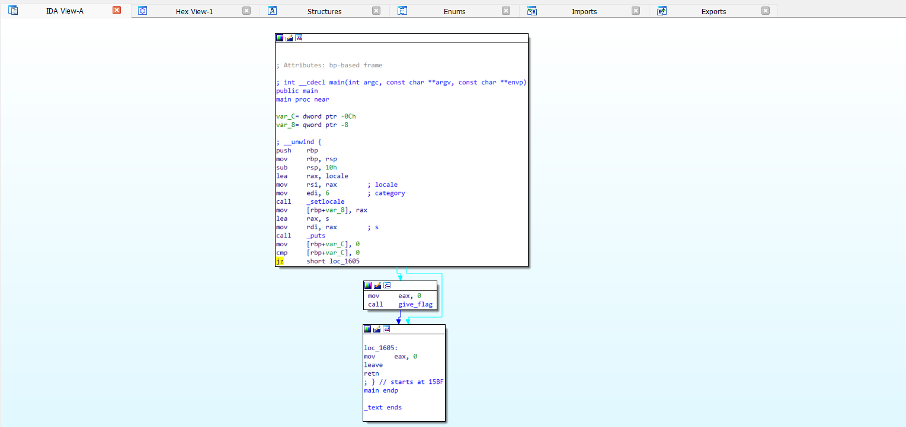
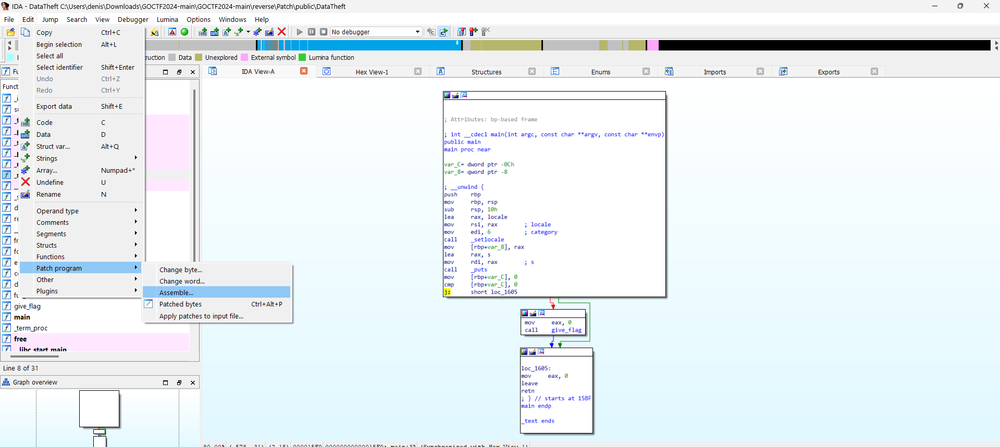
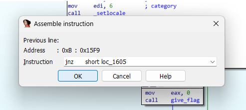
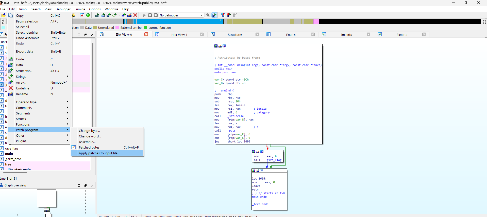

# DataTheft
## Сложность
Medium

## Описание
Однажды, к вам в руки попал таинственный файл. Этот файл, как будто бы написанный самим Богом-программистом, был ключом к великой тайне. Но, как это часто бывает в мире технологий, не всё идёт гладко. Программа отказывалась раскрыть свою тайну и выдавать нужную информацию.

**!Участникам нужно выдать содержимое папки public!**

## Решение:
Для решения задачи нужно запустить IDA, найти метод main

После вы могли заметить условие которое нужно запатчить для этого выберите Patch programm/Assemble

Поменяйте в условии jz на jnz

И примените изменения

## Флаг
GOCTF{did_you_make_the_patch?}
