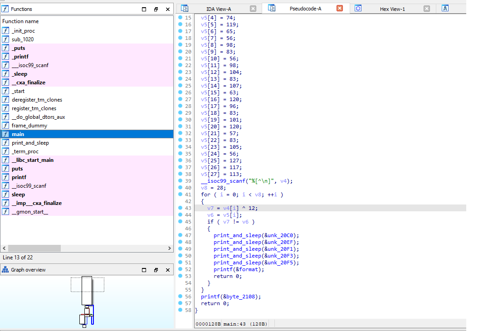

# Investigation
## Сложность
Easy

## Описание
Вы оказались в сложной ситуации. Вас обвинили в сокрытии важной информации, которая могла бы изменить судьбу всего цифрового мира. Но была одна загвоздка: у вас самих нет данных. Все, что у вас есть, — это исходный код программы, зашифровавшей данные.

Надеюсь у вас получиться преодолеть все препятствия и выбраться из столь непростой ситуации.

**!Участникам нужно выдать содержимое папки public!**

## Решение:
Первым делом нужно найти метод `main` в декомпиляторе, в псевдокоде находится массив из значений зашифрованного xor-ом флага, после чего в этом же методе находится ключ. 



Зная значения массива и ключа, можно написать дешифратор:
```
key = 12

values = [75, 67, 79, 88, 74, 119, 65, 56, 98, 83, 56, 98, 104, 83, 107, 63, 120, 96, 83, 101, 120, 57, 83, 105, 56, 127, 117, 113]

decoded_text = ''.join(chr(value ^ key) for value in values)

print("Расшифрованный текст:", decoded_text)
``` 
## Флаг
GOCTF{M4n_4nd_g3tl_it5_e4sy}
