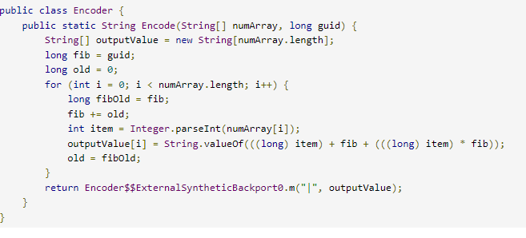
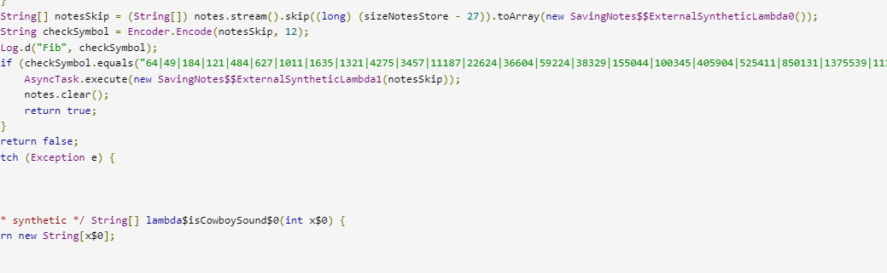

# Piano
## Сложность
Hard

## Описание
Однажды, вы попали в салун и обнаружил старое пианино. Вы сели за него и начали играть свою любимую мелодию. Толпа, которая собралась вокруг вас, пришла в восторг и просила выйти вас на бис. Вы конечно же согласились. Но, чтобы исполнить свою любимою мелодию, вам придется решить ряд головоломок кибербезопасности, связанных с пианино и его тайнами.

**!Участникам нужно выдать содержимое папки public!**

## Развертывание
Из папки deploy запустить 
`docker compose up -d --build`

Затем в файле `source/src/app/build.gradle.kts` заменить `"\"http://172.30.0.195:5001/\""` на адрес API и запустить создание
`./build.sh`

APK файл из папки `source/build` выдать участникам.

## Решение:
Если проанализиировать код можно заметить класс Encode, в котором выполняеться шифрование последовательности нажатий нот



Для решения нам потребуется узнать зашифрованное значение, смещение и написать декодер для класса

Значения смещения и защифрованное значение находиться в классе SavingNotes.java



Код для декодера 

```
def dec(enc, guid):
    data = enc.split("|")
    cnt = len(data)
    old = 0
    fib_old = 0
    fib = guid
    numbs = []
    
    for i in range(cnt):
        fib_old = fib
        fib = fib + old
        s = int(data[i])
        numbs.append(int((s - fib) / (1 + fib)))
        old = fib_old
    str_numbs = [str(n) for n in numbs]
    return '|'.join(str_numbs)

print(dec("64|49|184|121|484|627|1011|1635|1321|4275|3457|11187|22624|36604|59224|38329|155044|100345|405904|525411|850131|1375539|1112833|3601203|2913433|9428067|19068664",12))
```

Затем используя полученную комбинация, необходимо нажать на клавиши в этой последовательности и получить флаг в логах приложения.

Чтобы получить логи приложения необходимо воспользоваться adb инструментом android studio. [Более подробно тут.](https://habr.com/ru/companies/redmadrobot/articles/687184/) 

## Флаг
GOCTF{C0wb0y_s0und}
