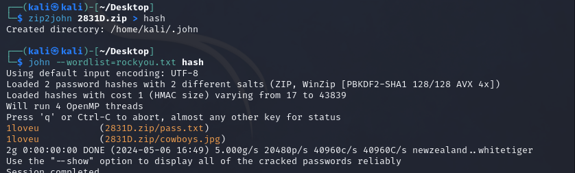

# Kalmar

### Сложность

Easy

### Информация

```
В старом западном городе, где правили законы револьвера и бутылка виски была единственной мерой справедливости, жил ковбой, которого прозвали Реверсером. Этот загадочный странник был известен не только своим умением владеть оружием, но и своим непревзойденным мастерством в обращении с технологиями. Но даже великие реверсеры могут совершать глупости. В одном из салунов он, в ярости после потери в азартной игре, небрежно уронил на пол сушеных кальмаров и отказался за собой убирать, что вызвало неудовольствие у владельца и привело к неожиданным последствиям.
```

### Описание

Предстоит исследовать изображение, чтобы обнаружить скрытые данные, используя техники стеганографии. Затем придется применить метод брутфорса для взлома пароля zip-архива, в котором спрятаны ценные сведения. Наконец, для раскрытия флага вам придется обратиться к сторонним утилитам, чтобы успешно завершить задание.


### Выдать учаcтникам

zip-архив - ka1mar.zip

### Решение

Первым делом нужно с помошью утилиты `binwalk` вытащить все что лежит внутри фото, используем с флагом -e `binwalk -e ka1mar.jpg`, после брутфорсим получивший zip-архив с помощью `john`, для того чтобы пробрутить, нужно получить хэш архива, используем такую команду: ```zip2john 2831D.zip > hash```. Затем уже можно приступить к самому брутфорсу, используем команду вышеупомянутую `john`, для брута достаточно стандартного словаря rockyou.txt, команда должна выглядеть следующим образом: ```john --wordlist=rockyou.txt hash``` и получаем пароль от архива (`1loveu`).



После, мы получаем еще одну картинку и файл с паролем, для получения флага воспользуемся еще одной утилитой `steghide`, для решения задачи. Команда: ```steghide extract -sf cowboys.jpg```, с паролем из архива `Gov0rilNeHochet`.

### Флаг

GOCTF{P0dN1m1_N3p0dn1Mu}
